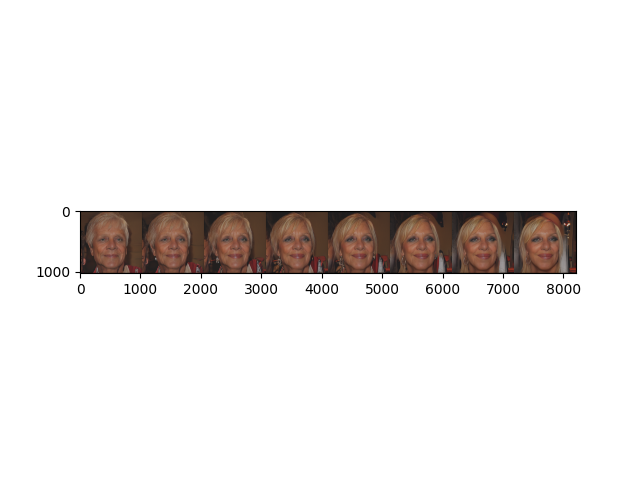
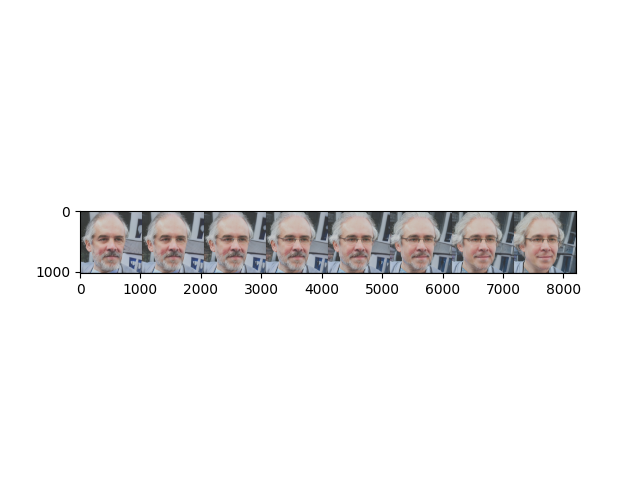
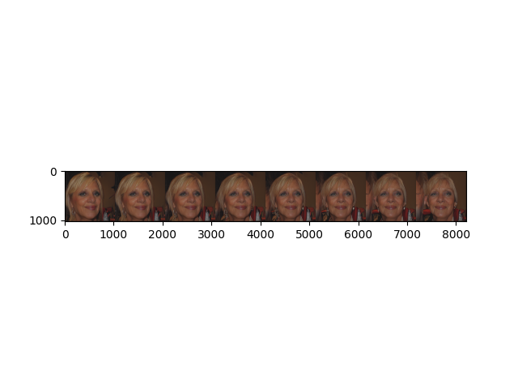
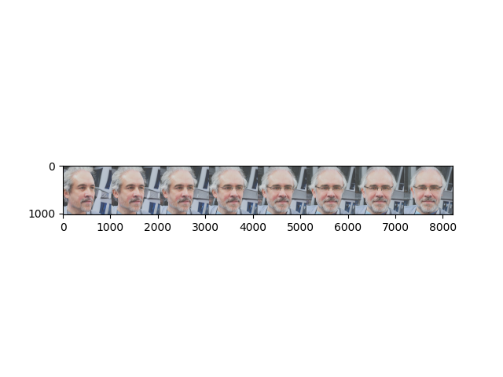

# GANspace
 Implementation of GAN space in pytorch <br>

(Paper) [GANSpace: Discovering Interpretable GAN Controls](https://arxiv.org/abs/2004.02546) <br>
(Official code) [GANSpace: Discovering Interpretable GAN Controls github](https://github.com/harskish/ganspace)
## Requirements
* python : 3.8
* torch : 1.10.0
* cuda : 11.1
* scikit-learn : 1.1.1

## Pre-Trained Weights - [GenForce](https://github.com/genforce/genforce)
This repository only use Stylegan2 generator pretrained on FFHQ <br> 
More pretrained weights are available at [GenForce](https://github.com/genforce/genforce).


## Usage
To find meaningful latent directions in w space, GANspace uses IncrementalPCA. 
By pushing our latent to principal component, latent code w = w + p * components.


#### Model 
```
# Get wlatent and save.

python main --MODE=S

```

```
# Compute principal components.
 
python main --MODE=P --p_component=[NUMBER_OF_COMPONENTS]

```

```
# Visualize and which components to push

python main --MODE=V --component_num=[WHICH_PC_TO_PUSH]

```

## Pushing  latent to principal component Direction

### Component [0]  hair

 
 


### Component [1] pose rotation

 
 